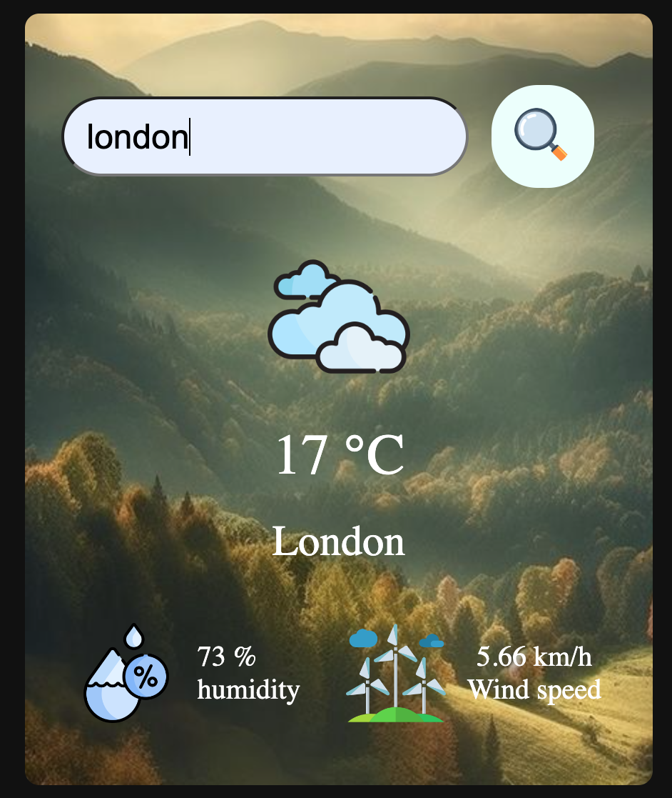
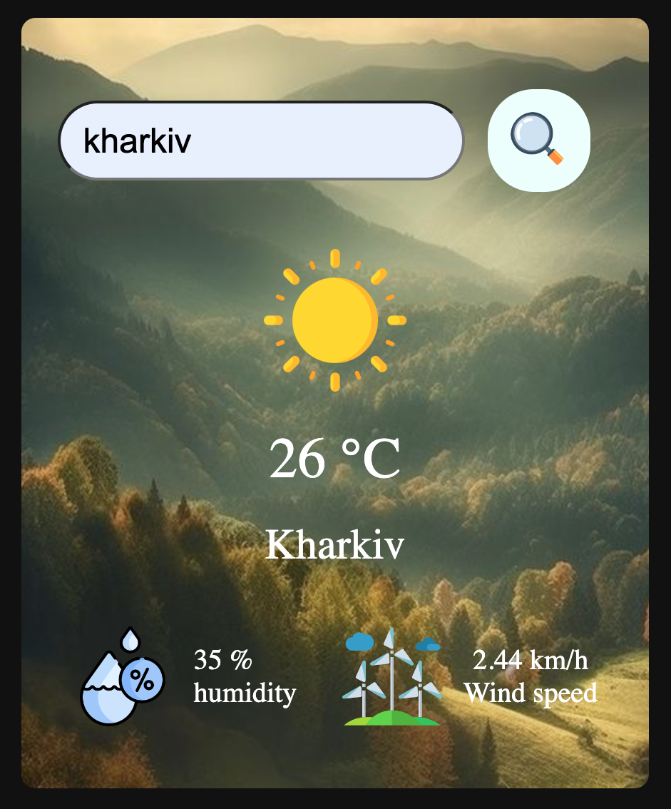

# weatherApp

Weather App
Weather App is an application that allows users to retrieve real-time weather conditions for their location. The app is built using HTML, SCSS, JavaScript, and React, and it utilizes a weather API to fetch the data.

Features
- Display current temperature, humidity, wind speed, and other weather conditions
- Stylish and user-friendly interface
- Integration with a weather API for retrieving accurate data

Screenshots

